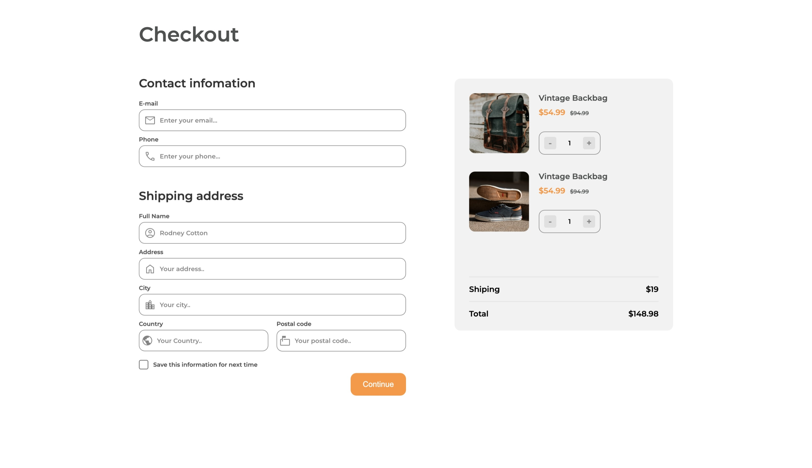

# Checkout Page



A professional and responsive checkout page built as part of a Dev Challenges project. This project demonstrates modern HTML and CSS techniques for building a clean, user-friendly checkout experience.

## Features
- Responsive design for desktop and mobile
- Modern, clean UI
- Organized layout for billing, shipping, and payment details
- Visual feedback for form fields
- Accessible and semantic HTML structure

## Technologies Used
- HTML5
- CSS3

## Getting Started
1. Clone the repository:
  ```bash
  git clone https://github.com/JanishkaM/checkout-page-master.git
  ```
2. Open `index.html` in your browser to view the checkout page.

## Folder Structure
```
checkout-page-master/
├── index.html
├── README.md
├── css/
│   └── style.css
├── img/
│   ├── devchallenges.png
│   ├── mail_FILL0_wght400_GRAD0_opsz48.png
│   ├── photo1.png
│   ├── photo2.png
│   └── screenshot.jpeg
```

## Credits
- [Dev Challenges](https://devchallenges.io/) for the project inspiration

## License
This project is licensed under the MIT License.
